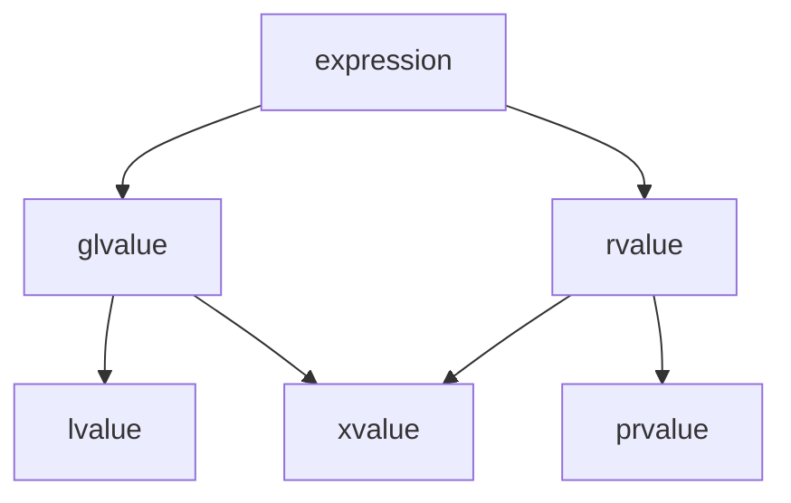

# 5. Целые и вещественные типы. Комплексные числа. Перечисляемый тип.

# Целочисленные типы в C++

Целые числа в языке C++ представлены следующими типами:

## Основные типы:

- **`signed char`**: 
  - Размер: 1 байт (8 бит)
  - Диапазон: от -128 до 127
  - Представляет один символ

- **`unsigned char`**:
  - Размер: 1 байт (8 бит)
  - Диапазон: от 0 до 255
  - Также представляет один символ

- **`char`**:
  - Размер: 1 байт (8 бит)
  - Диапазон: -128 до 127 ИЛИ 0 до 255 (зависит от компилятора)
  - Представляет символ ASCII
  - Может быть эквивалентен `signed char` или `unsigned char`

## Короткие целые:

- **`short`** (синонимы: `short int`, `signed short int`, `signed short`):
  - Размер: 2 байта (16 бит)
  - Диапазон: от -32 768 до 32 767

- **`unsigned short`** (синоним: `unsigned short int`):
  - Размер: 2 байта (16 бит)
  - Диапазон: от 0 до 65 535

## Основные целые:

- **`int`** (синонимы: `signed int`, `signed`):
  - Размер: обычно 4 байта (32 бита), но может быть 2 байта (16 бит)
  - Диапазон: от -2 147 483 648 до 2 147 483 647 (для 4 байт)

- **`unsigned int`** (синоним: `unsigned`):
  - Размер: обычно 4 байта (32 бита)
  - Диапазон: от 0 до 4 294 967 295

## Длинные целые:

- **`long`** (синонимы: `long int`, `signed long int`, `signed long`):
  - Размер: 4 или 8 байт
  - Диапазон: от -2 147 483 648 до 2 147 483 647 (4 байта) или от -9 223 372 036 854 775 808 до +9 223 372 036 854 775 807 (8 байт)

- **`unsigned long`** (синоним: `unsigned long int`):
  - Размер: 4 байта (32 бита)
  - Диапазон: от 0 до 4 294 967 295

## Очень длинные целые:

- **`long long`** (синонимы: `long long int`, `signed long long int`, `signed long long`):
  - Размер: 8 байт (64 бита)
  - Диапазон: от -9 223 372 036 854 775 808 до +9 223 372 036 854 775 807

- **`unsigned long long`** (синоним: `unsigned long long int`):
  - Размер: 8 байт (64 бита)
  - Диапазон: от 0 до 18 446 744 073 709 551 615

## Пример использования:

```cpp
#include <iostream>
 
int main()
{
    signed char num1{ -64 };
    unsigned char num2{ 64 };
    short num3{ -88 };
    unsigned short num4{ 88 };
    int num5{ -1024 };
    unsigned int num6{ 1024 };
    long num7{ -2048 };
    unsigned long num8{ 2048 };
    long long num9{ -4096 };
    unsigned long long num10{ 4096 };
    
    std::cout << "num1 = " << num1 << std::endl;
    std::cout << "num2 = " << num2 << std::endl;
    std::cout << "num3 = " << num3 << std::endl;
    std::cout << "num4 = " << num4 << std::endl;
    std::cout << "num5 = " << num5 << std::endl;
    std::cout << "num6 = " << num6 << std::endl;
    std::cout << "num7 = " << num7 << std::endl;
    std::cout << "num8 = " << num8 << std::endl;
    std::cout << "num9 = " << num9 << std::endl;
    std::cout << "num10 = " << num10 << std::endl;
}  
```


Числа с плавающей точкой в C++(вещественный тип вроде как)
===============================

Основные понятия
---------------

Для хранения дробных чисел в C++ применяются числа с плавающей точкой. Число с плавающей точкой состоит из двух частей: 
**мантиссы** и **показателя степени**. Оба могут быть как положительными, так и отрицательными. Величина числа – это 
мантисса, умноженная на десять в степени экспоненты.

Примеры записи
--------------

Например, число 365 может быть записано в виде числа с плавающей точкой следующим образом:


   3.650000E02

В качестве разделителя целой и дробной частей используется символ точки. Мантисса здесь имеет семь десятичных цифр - 
3.650000, показатель степени - две цифры 02. Буква E означает экспоненту, после нее указывается показатель степени 
(степени десяти), на которую умножается часть 3.650000 (мантисса), чтобы получить требуемое значение. 

Математически это представляется как:


   3.650000 \times 10^2 = 365

Другой пример - возьмем небольшое число:


   -3.650000E-03

В данном случае мы имеем дело с числом -3.65 * 10^{-3}, что равно -0.00365. Здесь мы видим, что в зависимости 
от значения показателя степени десятичная точка "плавает". Собственно поэтому их и называют числами с плавающей точкой.

Ограничения точности
--------------------

Однако хотя такая запись позволяет определить очень большой диапазон чисел, не все эти числа могут быть представлены 
с полной точностью; числа с плавающей запятой в целом являются приблизительными представлениями точного числа. 

Например, число 1254311179 выглядело бы так:


   1.254311E09

Однако если перейти к десятичной записи, то это будет 1254311000. А это не то же самое, что и 1254311179, поскольку мы 
потеряли три младших разряда.


## Основные типы

### `float` (одинарная точность)
- **Размер:** 4 байта (32 бита)
- **Диапазон:** ±1.18×10⁻³⁸ до ±3.4×10³⁸
- **Точность:** 7-8 значащих цифр
- **Литералы:** `3.14f`, `2.5e-3f`

### `double` (двойная точность)
- **Размер:** 8 байт (64 бита)
- **Диапазон:** ±2.23×10⁻³⁰⁸ до ±1.79×10³⁰⁸
- **Точность:** 15-16 значащих цифр
- **Литералы:** `3.14`, `2.5e-3` (по умолчанию)

### `long double` (расширенная точность)
- **Размер:** 8-16 байт (зависит от платформы)
- **Диапазон:** Зависит от реализации
- **Точность:** 18-19 значащих цифр
- **Литералы:** `3.14L`, `2.5e-3L`


Внутреннее представление
------------------------

В своем внутреннем бинарном представлении каждое число с плавающей запятой состоит из:

* Для ``float``:
  - 1 бит знака
  - 8 бит для экспоненты
  - 23 бита для мантиссы
  - Итого: 32 бита (4 байта)
  - Точность: ~7 десятичных знаков

* Для ``double``:
  - 1 бит знака
  - 11 бит для экспоненты
  - 52 бита для мантиссы
  - Итого: 64 бита (8 байт)
  - Точность: ~16 десятичных знаков

Для типа ``long double`` расклад зависит от конкретного компилятора и реализации этого типа данных. Большинство 
компиляторов предоставляют точность до 18-19 десятичных знаков (64-битная мантисса), в других же (как например, 
в Microsoft Visual C++) ``long double`` аналогичен типу ``double``.

Литералы с плавающей точкой
---------------------------

В C++ литералы чисел с плавающей точкой представлены дробными числами, которые в качестве разделителя целой и дробной 
частей применяют точку:

   double num {10.45};

Даже если переменной присваивается целое число, чтобы показать, что мы присваиваем число с плавающей точкой, 
применяется точка:

   double num1{ 1 };    // 1 - целочисленный литерал
   
   double num2{ 1. };   // 1. - литерал числа с плавающей точкой

Число ``1.`` представляет литерал числа с плавающей точкой, и в принципе аналогичен ``1.0``.

Суффиксы типов
--------------

По умолчанию все такие числа с точкой расцениваются как числа типа ``double``. Чтобы показать, что число представляет 
другой тип:


   float num1{ 10.56f };     // суффикс f/F для float
   
   long double num2{ 10.56l }; // суффикс l/L для long double

Экспоненциальная запись
-----------------------

В качестве альтернативы также можно применять экспоненциальную запись:

   double num1{ 5E3 };      // 5E3 = 5000.0
   
   double num2{ 2.5e-3 };   // 2.5e-3 = 0.0025


   **Дополнительные материалы:**
🔹 [Целочисленные типы данных в C++ - Metanit](https://metanit.com/cpp/tutorial/2.3.php)

надо  ток теперь это Комплексные числа. Перечисляемый тип. я еще посмотрю 

# 6.Неявные и явные преобразования типов.
# Статическая типизация и преобразования типов


С++ является статически типизированным языком программирования. То есть если мы определили для переменной какой-то тип данных, то в последующем мы этот тип изменить не сможем. Соответственно переменная может получить значения только того типа, который она представляет. Однако нередко возникает необходимость присвоить переменной значения каких-то других типов. И в этом случае применяются преобразования типов.

Ряд преобразований компилятор может производить неявно, то есть автоматически. Например:

~~~ cpp
#include <iostream>
 
int main()
{
    unsigned int age{25};
    std::cout << "age = " << age << std::endl;
}
~~~

Здесь переменная `age` представляет тип `unsigned int` и условно хранит возраст. Эта переменная инициализируется числом 25, а все целочисленные литералы без суффиксов по умолчанию представляют тип `int` (signed int). Но компилятор знает как преобразовать значение 25 к типу `unsigned int`, и каких-то проблем в данном случае не будет.

Но посмотрим на другой пример:

```cpp
#include <iostream>
 
int main()
{
    unsigned int age{-25};
    std::cout << "age = " << age << std::endl;
}
```
Здесь переменной `age` присваивается число `-25` (отрицательное), в то время как тип переменной — `unsigned int` — предполагает только положительные числа. В этом случае возникнет ошибка компиляции. Например, вывод компилятора `g++`:

```text
error: narrowing conversion of '-25' from 'int' to 'unsigned int' [-Wnarrowing]
```

## Примеры неявных преобразований

Рассмотрим, как выполняются некоторые базовые преобразования:

### Преобразование в `bool`
Переменной типа `bool` присваивается значение другого типа. В этом случае:
- `false`, если значение равно `0`
- `true` во всех остальных случаях

```cpp
bool a = 1;     // true
bool b = 0;     // false
bool c = 'g';   // true
bool d = 3.4;   // true
```
Числовой или символьной переменной присваивается значение типа bool. В этом случае переменная получает 1, если значение равно true, либо получает 0, если присваиваемое значение равно false.
```
int c = true;       // 1
double d = false;   // 0
```
Целочисленной переменной присваивается дробное число. В этом случае дробная часть после запятой отбрасывается.

```
int a = 3.4;        // 3
int b = 3.6;        // 3
```
Переменной, которая представляет тип с плавающей точкой, присваивается целое число. В этом случае, если целое число содержит больше битов, чем может вместить тип переменной, то часть информации усекается.

```
float a = 35005;                // 35005
double b = 3500500000033;       // 3.5005e+012
```
Переменной беззнакового типа (unsigned) присваивается значение не из его диапазона. В этом случае результатом будет остаток от деления по модулю. Например, тип unsigned char может хранить значения от 0 до 255. Если присвоить ему значение вне этого диапазона, то компилятор присвоит ему остаток от деления по модулю 256 (так как тип unsigned char может хранить 256 значений). Так, при присвоении значения -5 переменная типа unsigned char получит значение 251

```
unsigned char a = -5;           // 251
unsigned short b = -3500;       // 62036
unsigned int c = -50000000;     // 4244967296
```
Переменной знакового типа (signed) присваивается значение не из его диапазона. В этом случае результат не детерминирован. Программа может выдавать адекватный результат, а может работать некорректно. 

# Явные преобразования типов
Для выполнения явных преобразований типов (explicit type conversion) применяется оператор static_cast
```
static_cast<type>(value)
```
Данный оператор преобразует значение в круглых скобках - value к типу, который указан в угловых скобках - type. Слово static в названии оператора отражает тот факт, что приведение проверяется статически, то есть во время компиляции.

Применение оператора static_cast указывает компилятору, что мы уверены, что в этом месте надо применить преобразование, поэтому даже при инициализации в фигурных скобках компилятор не сгенерирует ошибку. Например, программист заработал за 8 часовой рабочий день 100,2$, рассчитаем его заработок за час, но в виде значения unsigned int:

```
#include <iostream>
 
int main()
{
    double sum {100.2};
    unsigned int hours {8};
    unsigned int revenuePerHour { static_cast<unsigned int>(sum/hours) };  // revenuePerHour = 12
    std::cout << "Revenue per hour = " << revenuePerHour<< std::endl;
}
```
Здесь выражение static_cast<unsigned int>(sum/hours) вычисляет значение выражения sum/hours (а оно будет представлять тип double), и затем преобразует его в тип unsigned int

Стоит отметить, что раньше во времена динозавров в С++ применялась операция преобразования, унаследованная от языка Си:

```
(тип) значение
```
То есть перед преобразуемым значением в круглых скобках указывался тип, в который надо выполнить преобразование. Например, используем эту операцию в ранее приведенном коде:

```
#include <iostream>
 
int main()
{
    double sum {100.2};
    unsigned int hours {8};
    unsigned int revenuePerHour { (unsigned int)sum/hours};     // revenuePerHour = 12
    std::cout << "Revenue per hour = " << revenuePerHour<< std::endl;
}
```
Результат будет тот же. Однако в современном C++ эту операцию практически вытеснил оператор static_cast.

## Полезные ресурсы

📚 **Рекомендуемая литература по теме:**
- [Неявные преобразования типов в C++](https://metanit.com/cpp/tutorial/2.4.php) - подробное руководство на Metanit

# 8.Динамическое выделение памяти в C++.


В C++ можно использовать различные типы объектов, которые различаются по использованию памяти. Так, глобальные объекты создаются при запуске программы и освобождаются при ее завершении. Локальные автоматические объекты создаются в блоке кода и удаляются, когда этот блок кода завершает работу. Локальные статические объекты создаются перед их первым использованием и освобождаются при завершении программы.

Глобальные, а также статические локальные объекты помещаются в статической памяти, а локальные автоматические объекты размещаются в стеке. Объекты в статической памяти и стеке создаются и удаляются компилятором. Статическая память очищается при завершении программы, а объекты из стека существуют, пока выполняется блок, в котором они определены. Когда блок завершает выполнение, то память в стеке, отведенная для переменных блока, освобождается. Стоит отметить, что память, выделяемая для стека, имеет ограниченный фиксированный размер.

В дополнение к этим типам в C++ можно создавать _динамические объекты_. Продолжительность их жизни не зависит от того, где они созданы. Динамические объекты существуют, пока не будут удалены явным образом. Динамические объекты размещаются в динамической памяти (free store). Это область памяти, не занятая операционной системой или другими загруженными в данный момент программами.

Использование динамических объектов имеет ряд преимуществ. Во-первых, более эффективное использование памяти - выделяется имеенно столько места, сколько необходимо, а после использования сразу освобождается. Во-вторых, мы можем использовать гораздо больший объем памяти, который в ином случае был бы не доступен. Но это и накладывает ограничения: мы должны следить, чтобы все динамические объекты были удалены.

Для управления динамическими объектами применяются операторы _**new**_ и _**delete**_.

Оператор _**new**_ выделяет место в динамической памяти для объекта и возвращает указатель на этот объект.

Оператор _**delete**_ получает указатель на динамический объект и удаляет его из памяти.

# Сравнение С и С++


| Характеристика          | C++ (`new`/`delete`)                          | C (`malloc`/`free`)                          |
|-------------------------|-----------------------------------------------|----------------------------------------------|
| **Синтаксис**           | `int* p = new int;`<br>`delete p;`            | `int* p = malloc(sizeof(int));`<br>`free(p);`|
| **Массивы**             | `int* arr = new int[10];`<br>`delete[] arr;`  | `int* arr = malloc(10*sizeof(int));`<br>`free(arr);` |
| **Инициализация**       | Поддерживается: `new int(5)`                  | Только через `calloc` (обнуление)            |
| **Приведение типов**    | Не требуется                                  | Требуется явное приведение `(int*)`           |
| **Обработка ошибок**    | Бросает `std::bad_alloc`                      | Возвращает `NULL`                            |
| **Конструкторы**        | Вызывает конструкторы                         | Не вызывает                                  |
| **Деструкторы**         | Вызывает деструкторы                          | Не вызывает                                  |
| **Изменение размера**   | Нет (нужно перевыделять)                      | Есть (`realloc`)                             |
| **Размер памяти**       | Вычисляется автоматически                     | Требуется ручной расчет через `sizeof`       |
| **Безопасность**        | Более типобезопасно                           | Менее безопасно                              |
| **Совместимость с ООП** | Полная поддержка ООП                          | Нет поддержки ООП                            |
| **Альтернативы**        | Умные указатели (`unique_ptr`, `shared_ptr`)  | Нет встроенных аналогов                      |


# Пример использования в коде:
C++:
```
// Одиночный объект
int* p = new int(42);
delete p;

// Массив
int* arr = new int[10]{1,2,3};
delete[] arr;

// Умный указатель
auto smartPtr = std::make_unique<int>(42);
```

C:
```
// Одиночный объект
int* p = (int*)malloc(sizeof(int));
*p = 42;
free(p);

// Массив
int* arr = (int*)malloc(10 * sizeof(int));
free(arr);

// Изменение размера
arr = (int*)realloc(arr, 20 * sizeof(int));
```

Подробнее можно прочитать [здесь][metanit-memory].  

[metanit-memory]: https://metanit.com/cpp/tutorial/4.11.php "Управление памятью в C++"  

# 9. Классы. Разграничение доступа к элементам класса. Специальные функции классов. friend. explicit.

Кроме использования встроенных типов, таких как int, double и т.д., мы можем определять свои собственные типы или классы. Класс представляет составной тип, который может использовать другие типы.

Класс предназначен для описания некоторого типа объектов. То есть по сути класс является планом объекта. А объект представляет конкретное воплощение класса, его реализацию. Можно еще провести следующую аналогию. У нас у всех есть некоторое представление о человеке, у которого есть имя, возраст, какие-то другие характеристики. То есть некоторый шаблон - этот шаблон можно назвать классом. Конкретное воплощение этого шаблона может отличаться, например, одни люди имеют одно имя, другие - другое имя. И реально существующий человек будет представлять объект или экземпляр этого класса.

Для определения класса применяется ключевое слово class, после которого идет имя класса:
```
class имя_класса
{
    // компоненты класса
};
```
После названия класса в фигурных скобках располагаются компоненты класса. Причем после закрывающей фигурной скобки идет точка с запятой.

Например, определим простейший класс:
```
class Person { };
 
int main()
{
 
}
```
В данном случае класс называется Person. Как правило, названия классов начинаются с большой буквы. Допустим, данные класс представляет человека. Данный класс пуст, не содержит никаких компонентов, тем не менее он уже представляет новый тип. И после определения класса мы можем определять его переменные или константы:
```
class Person
{
 
};
int main()
{
    Person person;
}
```
Но данный класс мало что делает. Класс может определять переменные и константы для хранения состояния объекта и функции для определения поведения объекта. Поэтому добавим в класс Person некоторое состояние и поведение:
```
#include <iostream>
 
class Person 
{
public:
    std::string name;
    unsigned age;
    void print() 
    {
        std::cout << "Name: " << name << "\tAge: " << age << std::endl;
    }
};
int main()
{
    Person person;
    // устанавливаем значения полей класса
    person.name = "Tom";
    person.age = 38;
    // вызываем функцию класса
    person.print();
}
```
Теперь класс Person имеет две переменных name и age, которые предназначены для хранения имени и возраста человека соответственно. Переменные класса еще называют полями класса. Также класс определяет функцию print, которая выводит значения переменных класса на консоль. Также стоит обратить внимание на модификатор доступа public:, который указывает, что идущие после него переменные и функции будут доступны извне, из внешнего кода.

Затем в функции main создается один объект класса Person. Через точку мы можем обратиться к его переменным и функциям.

```
объект.компонент
```
Например, мы можем установить значения полей класса
```
person.name = "Tom";
person.age = 38;
```
Ну и также мы можем вызывать функции у объекта:
```
person.print();
```
Консольный вывод данной программы:
```
Name: Tom	Age: 38
```
[Полезное про классы](https://metanit.com/cpp/tutorial/5.1.php "Указатели в C++ на Metanit.com")

## Управление доступом. Инкапсуляция
  
Класс может определять различное состояние, различные функции. Однако не всегда желательно, чтобы к некоторым компонента класса был прямой доступ извне. Для разграничения доступа к различным компонентам класса применяются спецификаторы доступа
Спецификатор public делает члены класса - поля и функции открытыми, доступными из любой части программы. Например, возьмем следующий класс Person:

```
#include <iostream>
 
class Person 
{
public:
    std::string name;
    unsigned age;
    void print() 
    {
        std::cout << "Name: " << name << "\tAge: " << age << std::endl;
    }
    Person(std::string p_name, unsigned p_age)
    { 
        name = p_name; 
        age = p_age;
    }
};
int main()
{
    Person tom{"Tom", 38};
    // поля name, age и функция print общедоступные
    tom.name = "Tomas"; 
    tom.age = 22;
    tom.print();    // Name: Tomas   Age: 22
}
```
То есть в данном случае поля name и age и функция print являются открытыми, общедоступными, и мы можем обращаться к ним во внешнем коде. Однако это имеет некоторые недостатки. ТаК, мы можем обратиться к полям класса и присвоить им любые значения, даже если они будут не совсем корректными, исходя из логики прогаммы:
```
Person tom("Tom", 22);
tom.name = "";
tom.age = 1001;
```
В том числе можно присвоить какие-то недопустимые значения. Например, полю age можно передать чересчур большой нереальвй возраст. Или мы не хотим, чтобы имени можно было присвоить пустую строку. Естественно это не очень хорошая ситуация.

Однако с помощью другого спецификатора private мы можем скрыть реализацию членов класса, то есть сделать их закрытыми, инкапсулировать внутри класса. Перепишем класс Person с применением спецификатора private:

```
#include <iostream>
 
class Person 
{
private:
    std::string name;
    unsigned age;
public:
    void print() 
    {
        std::cout << "Name: " << name << "\tAge: " << age << std::endl;
    }
    Person(std::string p_name, unsigned p_age)
    { 
        name = p_name; 
        age = p_age;
    }
};
int main()
{
    Person tom{"Tom", 38};
    // функция print общедоступная
    tom.print();    // Name: Tom   Age: 22
 
    // поля name и age вне класса недоступны
    // tom.name = "";  
    // tom.age = 1001;
}'
```
Все компоненты, которые определяются после спецификатора private и идут до спецификатора public, являются закрытыми, приватными. Теперь теперь мы не можем обратиться к переменным name и age вне класса Person. Мы можем к ним обращаться только внутри класса Person. А функция print и конструктор по прежнему общедоступные, поэтому мы можем обращаться к ним в любом месте программы.

Стоит отметить, что в данном случае мы все равно можем передать некорректные значения - через конструктор. В этом случае можно проверять входные данные и использовать различные стратегии, например, не создавать объект или передавать ему данные по умолчанию, но в целях упрощения я опущу подобную проверку.

Если для каких-то компонентов отсутствует спецификатор доступа, то по умолчанию применяется спецификатор private. Так, предыдущий класс Person будет аналогичен следующему
```
class Person 
{
    std::string name;
    unsigned age;
public:
    void print() 
    {
        std::cout << "Name: " << name << "\tAge: " << age << std::endl;
    }
    Person(std::string p_name, unsigned p_age)
    { 
        name = p_name; 
        age = p_age;
    }
};
```
[Возможно чето полезное будет(впринципе тоже самое что и до этого читал)](https://metanit.com/cpp/tutorial/5.4.php)

##  СПЕЦИАЛЬНЫЕ ФУНКЦИИ
Специальные функции классов в C++ — это особые методы, которые компилятор генерирует автоматически (если они не объявлены явно), обеспечивая базовую функциональность класса. Они играют ключевую роль в управлении созданием, копированием, перемещением и уничтожением объектов.

Классы имеют ряд специальных функций

_Конструктор по умолчанию_ - вызывается при создании объекта (при вызове new).
_Деструктор_ - в момент завершения полного выражения, вызывается для уничтожения объекта.
_Конструктор копирования_ - инициализировать объект можно и передав другой объект этого же типа, при этом в новый объект будут скопированы значения полей переданного.
_Конструктор перемещения_ - аналогично копированию, только поля оригинального объекта будут обнулены.
_Оператор присваивания копированием_ - оператор = для lvalue объекта.
_Оператор присваивания перемещением_- оператор = для rvalue объекта.
Как правило они не требуют определения, так как принцип единой ответственности (Single Responsibility Principle) гласит о том, что у каждого объекта должна быть лишь одна задача, спец. функции определяются только для тех объектов, задача которых заключается в управлении собственной памятью.

Нужно помнить правило "пяти" - если вам нужно нетривиально определить один из них, то вам нужно определить все пять.

ВНИМАНИЕ!!! Если у Вас в классе есть хотя бы один виртуальный метод (то есть тот, который при наследовании требует переопределения - override), то вам нужно сделать и деструктор виртуальным (он может быть пустым), чтобы удалять объекты производного класса по указателю на базовый класс.

| Функция-член              | Типичная форма для класса C              |
|---------------------------|------------------------------------------|
| Конструктор по умолчанию  | `C::C();`                                |
| Деструктор                | `C::~C();`                               |
| Конструктор копирования   | `C::C(const C&);`                        |
| Присваивание копированием | `C& operator=(const C&);`                |
| Конструктор перемещения   | `C::C(C&&);`                             |
| Присваивание перемещением | `C& operator=(C&&);`                     |

[Возможно чето полезное будет(вот тут прям можно подробно почитать вроде как)](https://metanit.com/cpp/tutorial/5.4.php)

## friend
### Дружественные функции и классы
  
Дружественные функции - это функции, которые не являются членами класса, однако имеют доступ к его закрытым членам - переменным и функциям, которые имеют спецификатор private.

Для определения дружественных функций используется ключевое слово friend. Например, определим следующую программу:
```
#include <iostream>
  
class Auto
{
    friend void drive(const Auto&);
    friend void setPrice(Auto&, unsigned);
public:
    Auto(std::string autoName, unsigned autoPrice) 
    { 
        name = autoName; 
        price = autoPrice;
    }
    void print()
    {
        std::cout << name << " : " << price << std::endl;
    }
  
private:
    std::string name;   // название автомобиля
    unsigned price;  // цена автомобиля
};
  
void drive(const Auto &car) 
{ 
    std::cout << car.name << " is driven" << std::endl;
}
void setPrice(Auto &car, unsigned price)
{
    car.price = price;
}
  
int main()
{
    Auto tesla("Tesla", 5000);
    tesla.print();  //
    drive(tesla);
    setPrice(tesla, 8000);
    tesla.print();  //
}
```
Здесь определен класс Auto, который представляет автомобиль. У этого класса определены приватные закрытые переменные name (название автомобиля) и price (цена автомобиля). Также в классе объявлены две дружественные функции: drive (функция вождения автомобиля) и setPrice (функция назначения цены). Обе этих функции принимают в качестве параметра ссылку на объект Auto.

Когда мы объявляем дружественные функции, то фактически мы говорим компилятору, что это друзья класса и они имеют доступ ко всем членам этого класса, в том числе закрытым.

При этом для дружественных функций не важно, определяются они под спецификатором public или private. Для них это не имеет значения.

Определение этих функций производится вне класса. И поскольку эти функции являются дружественными, то внутри этих функций мы можем через переданную ссылку Auto обратиться ко всем его закрытым переменным.

Консольный вывод программы:
```
Tesla : 5000
Tesla is driven
Tesla : 8000
```
### Определение дружественных функций в классе
Дружественные функции могут определяться в другом классе. Например, определим класс Person, который использует объект Auto:
```
#include <iostream>
 
class Auto; // объявление класса Auto, чтобы Person видел этот класс
 
class Person
{
public:
    Person(std::string p_name)
    {
        name = p_name;
    }
    void drive(const Auto&);
    void setPrice(Auto&, unsigned);
 
private:
    std::string name;
};
 
class Auto
{
    // объявление дружественных функций
    friend void Person::drive(const Auto&);
    friend void Person::setPrice(Auto&, unsigned);
public:
    Auto(std::string a_name, unsigned a_price) 
    { 
        name = a_name; 
        price = a_price;
    }
    void print()
    {
        std::cout << name << " : " << price << std::endl;
    }
  
private:
    std::string name;   // название автомобиля
    unsigned price;  // цена автомобиля
};
  
void Person::drive(const Auto &car) 
{ 
    std::cout << name << " drives " << car.name << std::endl;
}
void Person::setPrice(Auto &car, unsigned price)
{
    car.price = price;
}
  
int main()
{
    Auto tesla{"Tesla", 5000};
    Person tom{"Tom"};
    tom.drive(tesla);
    tom.setPrice(tesla, 8000);
    tesla.print();  
}
```
Вначале определен класс Person, который представляет человека. Однако поскольку класс Person использует класс Auto, то перед классом Person идет объявление класса Auto.

Две функции из класса Person принимают ссылку на объект Auto:
```
void drive(const Auto&);
void setPrice(Auto&, unsigned);
```
То есть фигурально говоря, человек водит автомобиль и назначает ему цену с помощью этих функциий.

Класс Auto определяет дружественные функции с той же сигнатурой:
```
friend void Person::drive(Auto&);
friend void Person::setPrice(Auto&, unsigned);
```
Причем поскольку данные функции будут определены в классе Person, то названия этих функций предваряются префиксом "Person::".

И поскольку в этих функциях предполагается использовать объект Auto, то ко времени определения этих функций все члены объекта Auto должны быть известны, поэтому определения функций находятся не в самом классе Person, а после класса Auto. И так как эти функции определены в классе Auto как дружественные, мы можем обратиться в этих функциях к закрытым членам класса Auto.

Консольный вывод программы:
```
Tom drives Tesla
Tesla : 8000
```
### Дружественные классы
В случае выше класс Person использует только две функции из класса Auto. Но допустим впоследствии возникла необходимость добавить в класс Auto еще ряд дружественных функций, которые будут определены в классе Person. Либо мы можем предполагать, что класс Person будет активно использовать объекты Auto. И в этом случае целесообразно определять не отдельные дружественные функции, а определить дружественным весь класс Person:
```
#include <iostream>
 
class Auto; // объявление класса Auto, чтобы Person видел этот класс
 
class Person
{
public:
    Person(std::string p_name)
    {
        name = p_name;
    }
    void drive(const Auto&);
    void setPrice(Auto&, unsigned);
 
private:
    std::string name;
};
 
class Auto
{
    // объявление дружественного класса
    friend class Person;
public:
    Auto(std::string a_name, unsigned a_price) 
    { 
        name = a_name; 
        price = a_price;
    }
    void print()
    {
        std::cout << name << " : " << price << std::endl;
    }
  
private:
    std::string name;   // название автомобиля
    unsigned price;  // цена автомобиля
};
  
void Person::drive(const Auto& car) 
{ 
    std::cout << name << " drives " << car.name << std::endl;
}
void Person::setPrice(Auto& car, unsigned price)
{
    car.price = price;
}
  
int main()
{
    Auto tesla{"Tesla", 5000};
    Person tom{"Tom"};
    tom.drive(tesla);
    tom.setPrice(tesla, 8000);
    tesla.print();  
}
```
Единственное, что в данном случае изменилось по сравнению с предыдущим примером - это то, что в классе Auto определение дружественных функций было заменено определением дружественного класса:
```
friend class Person;
```
То есть тем самым мы опять же говорим, что класс Person - это друг класса Auto, поэтому объекты Person могут обращаться к приватным переменным класса Auto. После этого в классе Person можно обращаться к закрытым членам класса Auto из любых функций.


## explicit

Ключевое слово explicit используется для явного указания компилятору, что конструктор или оператор преобразования должны использоваться только в явных (explicit) преобразованиях типов, а не в неявных. Это помогает предотвратить неявные преобразования типов, которые могут привести к неожиданным результатам.

### Явное использование конструктора:
```
class MyClass {
public:
    // Объявление явного конструктора
    explicit MyClass(int value) : data(value) {}

private:
    int data;
};

int main() {
    // Ошибка компиляции - неявное преобразование от int к MyClass
    // MyClass obj = 42;

    // Явное преобразование типов
    MyClass obj = static_cast<MyClass>(42);

    return 0;
}
```
В этом примере конструктор MyClass объявлен с использованием ключевого слова explicit, что предотвращает неявное преобразование от int к MyClass.

### Явное использование оператора преобразования:
```
class Distance {
public:
    explicit operator int() const {
        // Реализация оператора преобразования
        return static_cast<int>(distance);
    }

private:
    double distance;
};

int main() {
    Distance d;
    // Ошибка компиляции - неявное преобразование от Distance к int
    // int result = d;

    // Явное преобразование типов
    int result = static_cast<int>(d);

    return 0;
}
```
В этом примере оператор преобразования operator int() объявлен с использованием explicit, что предотвращает неявное преобразование от Distance к int.

### Дополнительные возможности:

  _**Предотвращение неявных преобразований**_
  **explicit** используется для предотвращения неявных преобразований типов, что может уменьшить вероятность ошибок в программе.
  
  _**Явная передача параметров:**_
  Ключевое слово **explicit** является частью языковой поддержки для создания более явного и предсказуемого кода.
  
### Почему использовать explicit: 
  **explicit** следует использовать, когда необходимо избежать неявных преобразований типов, которые могут вести к непредсказуемому поведению программы.
### Когда использовать explicit:
  Когда есть риск неявного преобразования типов, и такое преобразование не предоставляет ожидаемых результатов.
Использование explicit в C++ способствует ясности и безопасности кода, предотвращая неявные преобразования типов, которые могут вести к ошибкам или непредсказуемому поведению программы.


### 10.Copy и Move семантика. Perfect forwarding. Правило reference-collapsing. 
Сначала  **lvalue и rvalue**
В С++ используемые значения мы можем разделить на две группы: lvalue и rvalue. lvalue представляет именованное значение, например, переменные, параметры, константы. С lvalue ассоциирован некоторый адрес в памяти, в котором на постоянной основе хранится некоторое значение. И мы можем lvalue присвоить некоторое значение. А rvalue - это то, что можно только присваивать, например, литералы или результаты выражений. Например:

```
int n = 5;
```
Здесь n представляет lvalue, а число 5 - rvalue. Подобные названия приняты, потому что n расположен слева от оператора присваивания (left value), а присваиваемое значение - число 5 справа от оператора присвоения (right value). Другой пример:
```
int n{5}
int k{n + 7};
```
Здесь n и k - lvalue, а 5 и выражение n + 7 - rvalue.
➡️ [**Тут еще есть**](https://metanit.com/cpp/tutorial/14.1.php) 

Копирование, перемещение и с ними связанное

Семантика перемещения (move semantics) в C++ была введена в стандарте C++11 для оптимизации работы с временными объектами, минимизируя количество ненужных копирований и повышая производительность. Основная идея заключается в том, чтобы “переместить” ресурсы (например, память) из одного объекта в другой, вместо их копирования.

## Копирование и перемещение
Копирование:

Конструктор копирования:
```
MyClass(const MyClass& other);
```
Оператор присваивания копированием:
```
MyClass& operator=(const MyClass& other);
```
При копировании создаётся новый объект, и все ресурсы оригинала дублируются. Это может быть дорого с точки зрения производительности, особенно для объектов, которые содержат большие массивы данных или управляют внешними ресурсами (например, файл).

Перемещение:
Конструктор перемещения:
```
MyClass(MyClass&& other) noexcept;
```
Оператор присваивания перемещением:
```
MyClass& operator=(MyClass&& other) noexcept;
```
При перемещении ресурсы временного объекта передаются новому объекту, а временный объект оставляется в безопасном для деструкции состоянии. Это гораздо дешевле по сравнению с копированием, так как не происходит дублирования данных.

Пример использования перемещения и копирования:
```
#include <iostream>
#include <utility> // Для std::move
 
class MyClass {
private:
    int* data;
    size_t size;
 
public:
    // Конструктор по умолчанию
    MyClass(size_t s = 0) : size(s) {
        data = s ? new int[s] : nullptr;
        std::cout << "Default Constructor" << std::endl;
    }
 
    // Конструктор копирования
    MyClass(const MyClass& other) : size(other.size) {
        data = size ? new int[size] : nullptr;
        std::copy(other.data, other.data + size, data);
        std::cout << "Copy Constructor" << std::endl;
    }
 
    // Конструктор перемещения
    MyClass(MyClass&& other) noexcept : data(other.data), size(other.size) {
        other.data = nullptr;
        other.size = 0;
        std::cout << "Move Constructor" << std::endl;
    }
 
    // Оператор присваивания копированием
    MyClass& operator=(const MyClass& other) {
        if (this != &other) {
            delete[] data;
            size = other.size;
            data = size ? new int[size] : nullptr;
            std::copy(other.data, other.data + size, data);
        }
        std::cout << "Copy Assignment" << std::endl;
        return *this;
    }
 
    // Оператор присваивания перемещением
    MyClass& operator=(MyClass&& other) noexcept {
        if (this != &other) {
            delete[] data;
            data = other.data;
            size = other.size;
            other.data = nullptr;
            other.size = 0;
        }
        std::cout << "Move Assignment" << std::endl;
        return *this;
    }
 
    // Деструктор
    ~MyClass() {
        delete[] data;
        std::cout << "Destructor" << std::endl;
    }
};
 
int main() {
    MyClass a(10);          // Вызов конструктора по умолчанию
    MyClass b = std::move(a); // Вызов конструктора перемещения
 
    MyClass c;
    c = std::move(b);       // Вызов оператора присваивания перемещением
 
    return 0;
}
```
**Повышение быстродействия программы за счёт перемещения:**

Уменьшение накладных расходов: Перемещение ресурсов (например, памяти) значительно дешевле копирования, так как нет необходимости дублировать данные.

Эффективное управление памятью: Перемещая ресурсы, мы избегаем ненужных операций выделения и освобождения памяти.

Ускорение выполнения программ: За счёт уменьшения количества копирований программа выполняется быстрее, что особенно важно при работе с большими данными или в высокопроизводительных приложениях.
➡️ [**Копирование и перемещение объектов в C++**](https://metanit.com/cpp/tutorial/14.2.php) - отличное руководство на Metanit с примерами


## Perfect forwarding (Прямая передача или идальная пересылка)## 

### Что такое Идеальная пересылка?

Идеальная переадресация в C++ — это метод, который позволяет пересылать аргументы другой функции, сохраняя их категорию (lvalue или rvalue). Это гарантирует, что объекты будут перемещены или скопированы надлежащим образом без лишних затрат, тем самым повышая производительность и эффективность.

В современном программировании на C++ идеальная переадресация имеет решающее значение. Она сводит к минимуму дублирование кода и позволяет писать более универсальный и эффективный код. Используя шаблоны и функцию `std::forward`, разработчики могут создавать универсальные функции, которые легко работают с различными типами данных.

Вот простой пример использования `std::forward` для достижения идеальной переадресации:

```
#include <iostream>
#include <utility>

template<typename T>
void wrapper(T&& arg) {
    process(std::forward<T>(arg));
}

void process(int& x) {
    std::cout << "Lvalue reference: " << x << std::endl;
}

void process(int&& x) {
    std::cout << "Rvalue reference: " << x << std::endl;
}

int main() {
    int a = 10;
    wrapper(a);          // Calls the lvalue reference overload
    wrapper(20);        // Calls the rvalue reference overload
}
```
### Роль `std::forward`
Что такое `std::forward`?
`std::forward` — это служебная функция в C++, которая обеспечивает идеальную пересылку аргументов. Она используется в шаблонных функциях для сохранения категории значения пересылаемого аргумента.

Использование `std::forward` на практике
Чтобы продемонстрировать `std::forward`, рассмотрим следующую реализацию:
```
template<typename T>
void wrapper(T&& arg) {
    func(std::forward<T>(arg));
}
```
В этом примере `arg` передаётся в `func`, сохраняя свой исходный тип, что делает его либо l-значением, либо r-значением.

Это особенно полезно при работе с функциями, принимающими как l-значения, так и r-значения, поскольку позволяет избежать ненужных копий и перемещений.
### Распространённые ошибки и как их избежать

Хотя переадресация является мощным инструментом, она может привести к созданию чрезмерно сложного кода. Используйте этот метод с осторожностью. Если функции не требуется пересылать параметры, рассмотрите возможность использования более простых подходов.

### Путаница между `std::move` и `std::forward`

Хотя они кажутся похожими, `std::move` и `std::forward` служат разным целям. `std::move` преобразует объект в rvalue, вызывая перемещение, в то время как `std::forward` сохраняет исходную категорию значения. Вот распространённая ошибка:
```
template<typename T>
void incorrectForward(T&& arg) {
    // This will always convert arg to an rvalue
    func(std::move(arg)); // Too aggressive
}
```
### Использование Perfect Forwarding для типов, не поддерживающих пересылку

Идеальная переадресация также не работает при применении к типам, которые нельзя переместить или скопировать (например, `std::unique_ptr`). Очень важно убедиться, что переадресуемые типы поддерживают эти операции.

### Когда следует использовать идеальную переадресацию в вашем коде

Используйте совершенную переадресацию в основном в тех случаях, когда:

Вы пишете библиотечные функции или универсальный код.

Вы хотите сохранить категорию значений для оптимизации.

Шаблоны функций должны поддерживать как l-значения, так и r-значения.

### Правило reference-collapsing 

Что такое сворачивание ссылок в C++?

В C++ ссылка — это псевдоним для другой переменной. Ссылки сами по себе не могут быть ссылками, то есть у нас не может быть ссылки на ссылку напрямую. Однако в шаблонах или других сценариях, связанных с выводом типов, мы можем столкнуться с ситуациями, в которых теоретически может существовать ссылка на ссылку. Правиласвёртки ссылок определяют, как компилятор обрабатывает эти ссылки для создания допустимого типа.

Потребность в рушащейся ссылке

Сворачивание ссылок используется для написания универсального и гибкого кода с помощью шаблонов. Без сворачивания ссылок шаблоны, включающие ссылки, могут приводить к сложному и неинтуитивному поведению или даже к ошибкам компиляции. Правила сворачивания ссылок обеспечивают предсказуемое поведение шаблонов, упрощая написание и поддержку кода.

Правила свертывания ссылок

Правила сворачивания ссылок в C++ можно обобщить следующим образом:
```
T& & становится T&: Если мы попытаемся создать ссылку на ссылку, где обе являются ссылками на lvalue (&), она сократится до одной ссылки на lvalue.

T& && становится T&: Если у нас есть ссылка на lvalue, которая ссылается на rvalue, она преобразуется в ссылку на lvalue.

T&& & становится T&: Если у нас есть ссылка на rvalue, ссылающаяся на ссылку на lvalue, она преобразуется в ссылку на lvalue.

T&& && становится T&&: Если у нас есть ссылка на rvalue, то ссылка на rvalue остаётся ссылкой на rvalue.
```
Эти правила гарантируют, что независимо от способа объединения ссылок результат будет соответствовать допустимому типу ссылки.

# 12. Шаблоны. constexpr и const.
## Шаблоны 
Шаблоны классов позволяют определить конструкции (функции, классы), которые используют определенные типы, но на момент написания кода точно не известно, что это будут за типы. Иными словами, шаблоны позволяют определить универсальные конструкции, которые не зависят от определенного типа.

Шаблоны функций (function template) позволяют определять функции, которые не зависят от конкретных типов.

Вначале рассмотрим пример, где это может пригодиться. Например, нам надо определить функцию для сложения двух чисел int, double и std::string. Первое, что приходит на ум, сделать перегрузку функции - для каждого типа определить свою версию:

```
#include <iostream>
 
int add(int, int);
double add(double, double);
std::string add(std::string, std::string);
 
int main()
{
    std::cout << "int: " << add(4, 5) << std::endl; 
    std::cout << "double: " << add(4.4, 5.5) << std::endl;
    std::cout << "string: " << add(std::string("hel"), std::string("lo")) << std::endl;
}
 
int add(int x, int y)
{
    return x + y;
}
double add(double x, double y)
{
    return x + y;
}
 
std::string add(std::string str1, std::string str2)
{
    return str1 + str2;
}
```
Данный пример отлично работает, производит вычисления, как и должен. Однако в данном случае мы сталкиваемся с тем, что функция add фактически повторяется. Ее версии фактически выполняют одно и то же действие, единственно что отличается тип параметров и возвращаемого значения.

Теперь применим шаблоны функций. Шаблоны функций представляют некоторый образец, по которому можно создать конкретную функцию, специфическую для определенного типа:

```
#include <iostream>
 
template<typename T> T add(T, T); // прототип функции
 
int main()
{
    std::cout << "int: " << add(4, 5) << std::endl; 
    std::cout << "double: " << add(4.4, 5.5) << std::endl;
    std::cout << "string: " << add(std::string("hel"), std::string("lo")) << std::endl;
}
template<typename T> T add(T a, T b)
{
    return a + b;
}
```
Определение шаблона функции начинается с ключевого слова _template_, после которого в угловых скобках идет слово typename и затем список параметров шаблона:

```
template<typename T> T add(T a, T b)
```
В данном случае после typename указан один параметр - T. Параметр шаблона представляет произвольный идентификатор, в качестве которого, как правило, применяются заглавные буквы, например, T. Но это необязательно. То есть в данном случае параметр T будет представлять некоторый тип, который становится известным во время компиляции. Это может быть и тип int, и double, и string, и любой другой тип. Но поскольку внутри функции мы применяем операцию сложения, важно, чтобы тип, который будет применяться вместо параметра T, поддерживал операцию сложения, которая возвращала бы объект этого же типа. Если вдруг используемый тип не будет применять операцию сложения, то на этапе компиляции мы столкнемся с ошибкой.

И при вызове функции add в нее можно передавать объекты и типа int, и типа double, и любого другого типа. При вызове функции компилятор на основании типа аргументов выведет конкретный тип, связанный с параметром шаблона T, и создаст экземпляр функции add, который работает с конкретным типом, и при вызове функции будет вызваться данный экземпляр функции. Если для последующего вызова функции требуется тот же экземпляр, то компилятор использует существующий экземпляр функции.

При этом также можно использовать ссылки, указатели, массивы, которые представляют тип параметра шаблона. Например, в программе выше передадим параметры по ссылке и сделаем их константными:

```
#include <iostream> 
 
template<typename T> T add(const T&, const T&); 
 
int main()
{
    std::cout << "int: " << add(4, 5) << std::endl; 
    std::cout << "double: " << add(4.4, 5.5) << std::endl;
    std::cout << "string: " << add(std::string("hel"), std::string("lo")) << std::endl;
}
template<typename T> T add(const T& a, const T& b)
{
    return a + b;
}
```
➡️ [**Шаблоны**](https://metanit.com/cpp/tutorial/9.2.php) 


## Шаблон класса
Шаблон класса (class template) позволяет задать внутри класса объекты, тип которых на этапе написания кода неизвестен и позволяют уменьшить повторяемость кода. Для определения шаблона класса применяется следующий синтаксис:
```
template <список_параметров>
class имя класса
{
    // содержимое шаблона класса
};
```
Для применения шаблонов перед классом указывается ключевое слово template, после которого идут угловые скобки. В угловых скобках указываются параметры шаблона. Если несколько параметров шаблона, то они указываются через запятую.

Сам шаблон класса, как и обычный класс, всегда начинается с ключевого слова class (или struct, если речь о структуре), за которым следует имя шаблона класса и тело определения в фигурных скобках. Как и в случае с обычным классом, все шаблон класса заканчивается точкой с запятой. Содержимое шаблона класса фактически аналогично определению стандартного класса за тем исключением, что внутри шаблона вместо конкретных типов мы можем использовать параметры шаблона, которые указаны в угловых скобках. Во всем остальном шаблон класса подобен обычному классу, который может наследоваться, определять функции, переменные, конструкторы, переопределять виртуальные функции и т.д.

Параметр в угловых скобках представляет произвольный идентификатор, перед которым указывается слово typename или class:
```
template <typename T>
// или так
template <class T>
```
Здесь определен один параметр, который называется T. Какое слово перед ним использовать - class или typename, не столь важно.

➡️ [**Шаблон класса**](https://metanit.com/cpp/tutorial/9.1.php) 


## constexpr и const

### Что такое const?

`const` — это ключевое слово в C++, которое используется для определения констант. Когда переменная объявлена как `const`, её значение нельзя изменить после инициализации. Такая неизменяемость имеет решающее значение в программировании, поскольку она гарантирует, что определённые значения останутся неизменными, тем самым предотвращая случайные изменения, которые могут привести к ошибкам.

### Пример использования const
Вот простой пример, демонстрирующий использование `const`:
```
const int MAX_SIZE = 100;
```
В этом примере `MAX_SIZE` определяется как постоянное целое число. Попытки изменить `MAX_SIZE` позже в коде приведут к ошибке компиляции.

### Что такое constexpr?

Введённый в C++11 спецификатор `constexpr` используется для объявления возможности вычисления функции или переменной во время компиляции. Это обеспечивает дополнительный уровень оптимизации производительности, поскольку позволяет выполнять определённые вычисления до запуска программы.

### Пример использования constexpr
Вот простой пример функции `constexpr`:
```
constexpr int square(int x) {
    return x * x;
}
```
Функция `square` может быть вычислена во время компиляции, что позволяет компилятору оптимизировать вызовы `square` с постоянными аргументами.

## 🆚 Сравнение `const` и `constexpr`

| Характеристика       | `const`                  | `constexpr`               |
|----------------------|--------------------------|---------------------------|
| **Время вычисления** | Время выполнения         | Время компиляции          |
| **Оптимизация**      | Может быть оптимизировано| Гарантированная оптимизация|
| **Использование в шаблонах** | Ограничено | Широко используется       |
| **Инициализация**    | Можно runtime-значения   | Только compile-time значения |


# 13.SFINAE. Концепты. type traits.

## SFINAE

Неудачная подстановка — это не ошибка (SFINAE) — принцип языка программирования C++, согласно которому компилятор не должен завершать компиляцию программы только потому, что он не может подставить параметр шаблона.Этот принцип позволяет использовать шаблоны метапрограммирования и дает компилятору возможность принимать решения на основе шаблона аргументов типов, что может быть полезно при работе со сложным кодом и труднообъяснимой логикой.

По сути, SFINAE — это возможность компетентному компилятору решить, какой шаблон использовать в данном случае.Решение принимается по типам шаблонов аргументов, и компилятор выбирает шаблон, наиболее подходящий для аргументов.

### Преимущества SFINAE:

SFINAE используется в различных сценариях, включая составление универсального кода и работу с традиционной логикой.

SFINAE позволяет компилятору решать, какой шаблон использовать, и дает программистам возможность писать код, который можно повторно использовать в разных контекстах без необходимости явно следовать приведенным параметрам шаблона.

SFINAE позволяет лучше использовать код повторно, поскольку один и тот же код можно применять к разным типам объектов и параметров.

SFINAE также позволяет лучше контролировать структуру кода, запуская компилятору принятие решений на основе типов параметров шаблона. Это может сократить объем логики алгоритма, который необходимо написать и понять.

SFINAE помогает сделать код более читаемым и удобным для сопровождения, поскольку логика программы более легкая.

В заключение, SFINAE — это мощная концепция программирования на C++, которая позволяет лучше использовать код повторно, повысить читаемость кода и лучше контролировать его структуру.Это ключевой компонент шаблонного метапрограммирования и важный инструмент для написания надежного и эффективного кода.


Пример:
```
// Программа C++ для реализации
// Ошибка замены не является ошибкой
#include <iostream>
#include <тип_черт>
​
с использованием  пространства имен  std ;
​
// ИСПОЛЬЗОВАНИЕ шаблона для избежания ошибок
шаблон  < имя_типа  T > 
void  print_type ( T  t )
{
    // Для целого числа
    если ( is_integral < T > :: значение ) {
        cout  <<  "T — целочисленный тип"  <<  endl ;
    }
​
    // Для плавающего числа
    иначе  если ( is_floating_point < T > :: значение ) {
        cout  <<  "T — тип с плавающей точкой"  <<  endl ;
    }
​
    // Все остальные
    еще {
        cout  <<  "T не является интегралом"
             <<  "или тип с плавающей точкой"  <<  endl ;
    }
}
​
// Код драйвера
целочисленный  основной ()
{
    // T — целочисленный тип
    тип_печати ( 10 );
​
    // T — тип с плавающей точкой
    тип_печати ( 10.5f );
​
    // T — целочисленный тип
    тип_печати ( истина );
​
    // T — целочисленный тип
    тип_печати ( 'а' );
​
    // T не является интегралом
    // или тип с плавающей точкой
    тип_печати ( "GFG" );
​
    вернуть  0 ;
}
```
Выходной сигнал
```
T — интегральный тип
T — тип с плавающей точкой
T — интегральный тип
T — интегральный тип
T не является целочисленным или плавающим типом.
```
В этом примере функция print_type() является шаблонной переменной, которая принимает один аргумент типа T.Внутри функции есть операторы if, которые используют признаки типов is_integral и is_floating_point для проверок типа T.Если T имеет ожидаемый тип, то результат, соответствующий отраслевому оператору, и выводится сообщение.Если T не имеет ожидаемого типа, выполняется ветвь else и выводится сообщение «T не является целочисленным типом или типом с плавающей запятой».

В этом принципе используется SFINAE, потому что оператор if использует признаки типа проверки типа T, и если T не соответствует ожидаемому типу, подстановка шаблона не сработает.Однако, поскольку применяется SFINAE, этот сбой не является ошибкой во времени компиляции, и вместо этого достигается другая ветвь успеха.

## Концепты

Концепты позволяют установить ограничения для параметров шаблонов (как шаблонов функций, так и шаблонов класса).

Концепт фактически представляет шаблон для именованного набора ограничений, где каждое ограничение предписывает одно или несколько требований для одного или нескольких параметров шаблона. В общем случае он имеет следующий вид
```
template <параметры>
concept имя_концепта = ограничения;
```
Список параметров концепта содержит один или несколько параметров шаблона. Во время компиляции компилятор оценивает концепты, чтобы определить, удовлетворяет ли набор аргументов заданным ограничениям.

Ограничения представляют условные выражения, которые возвращают значение типа bool - если параметр типа удовлетворяет условию, то возвращается true.

Простейший пример:
```
template <typename T>
concept size = sizeof(T) <= sizeof(int);
```
В данном случае определен концепт size. Его смысл в том, что тип, который будет передаваться через параметр T, должен удовлетворять условию sizeof(T) <= sizeof(int). То есть физический размер объектов типа T не должен быть больше размера значений типа int.

Чтобы определить, соответствует ли определенный тип концепту, надо использовать выражение концепта, которое состоит из имени концепта, после которого в угловых скобках указываются аргументы для параметров шаблона.

1
имя_концепта<значения_для_параметров>
Например, проверим в действии вышеопределенный концепт size:
```
#include <iostream>
 
template <typename T>
concept size = sizeof(T) <= sizeof(int);
 
int main()
{
    std::cout << std::boolalpha << size<unsigned int> << std::endl;      // true
    std::cout << std::boolalpha << size<char> << std::endl;     // true
    std::cout << std::boolalpha << size<double> << std::endl;   // false 
}
```
В данном случае выражения size<unsigned int> и size<char> удовлетворяют ограничению концепта, так как применяемые в них типы unsigned int и char по размеру не превосходят или меньше размера типа int. Поэтому эти выражения возвратят true. А выражение size<double> не соответствует ограничению концепта, так как размер типа double больше размера типа int, поэтому это выражение возвратит false

Одни концепты могут основываться на других концептах. Например:
```
#include <iostream>
 
template <typename T>
concept small_size = sizeof(T) < sizeof(int);
template <typename T>
concept big_size = sizeof(T) > sizeof(long);
 
template <typename T>
concept size = small_size<T> || big_size<T>;
 
int main()
{
    std::cout << std::boolalpha << size<unsigned int> << std::endl; // false
    std::cout << std::boolalpha << size<char> << std::endl;         // true
    std::cout << std::boolalpha << size<double> << std::endl;       // true
}
```
Вначале определяется два простейших концепта. small_size требует, чтобы размер типа был меньше размера типа int. А концепт big_size требует, чтобы размер типа был больше размера типа long. С помощью стандартных логических операций && и || монжно объединять ограничения. И в данном случае концепт size требует, что тип T удовлетворял либо условию small_size<T>, либо big_size<T>:

```
concept size = small_size<T> || big_size<T>;
```
Теперь главный вопрос - зачем все эти концепты нужны? Мы можем применять концепты в качестве ограничений для шаблонов:
```
#include <iostream>
 
template <typename T>
concept size = sizeof(T) <= sizeof(int);
 
template <typename T> requires size<T> // в качестве ограничения применяется size
T sum(T a, T b){ return a + b;}
 
int main()
{
    std::cout << sum(10, 3) << std::endl;       // 13
    //std::cout << sum(10.6, 3.7) << std::endl; // ! Ошибка
}
```
В данном случае определен концепт size, согласно которому размер типа T должен быть равен или меньше размера типа int.

При определении шаблона функции sum в качестве ограничения применяется концепт size:

```
template <typename T> requires size<T>
```
То есть значения, которые будут передаваться в эту функцию, должны представлять тип, размер которого не больше размера типа int. Таким образом, мы можем вызвать эту функцию, передава ей значения типа int:
```
sum(10, 3)
```
Но мы не можем передать значения типа double, так как эти значения занимают в памяти 8 байт - больше чем значения типа int:
```
sum(10.6, 3.7)
```
Поэтому последняя строка в коде закомментрирована. И если бы мы расскоментировали ее, то на этапе компиляции получили бы ошибку.

## type traits 

  
<type_traits>содержит шаблоны, которые предоставляют информацию о свойствах типов (например, является ли тип целочисленным или с плавающей запятой), отношениях между типами (например, является ли один тип производным от другого) и модификациях типов (например, добавление или удаление константности). Эти запросы можно использовать при написании универсальных алгоритмов или разработке библиотек шаблонов, которые должны адаптировать своё поведение в зависимости от типов, с которыми они работают.

Чтобы использовать в программе признаки типов, включите библиотеку type_traits.
```
#include <type_traits>
```
Синтаксис для использования признаков типов в C++
```
trait_name<T>::value
```
Здесь, 

trait_name Это название признака типа, который вы хотите использовать.

T это тип, который вы хотите проверить.

Эта ::value часть выдаст результат для заданного типа T.

### Категории <type_traits> в C++

Черты характера делятся на следующие категории:

### 1. Признаки унарного типа
Для проверки свойств объекта одного типа используются следующие функции:
```
is_integral: is_integral проверяет, является ли тип целочисленным.
is_floating_point: is_floating_point проверяет, является ли тип типом с плавающей запятой (например, float, double).
is_array: is_array проверяет, является ли тип массивом.
is_const: is_const проверяет, является ли тип типом с квалификацией const.
is_reference: is_reference проверяет, является ли тип ссылочным.
```
### 2. Признаки бинарного типа
Для установления связей между двумя объектами используются следующие функции:
```
is_same: is_same сравнивает, являются ли два типа абсолютно одинаковыми.
is_convertible: is_convertible определяет, можно ли преобразовать значение одного типа в другой.
```
### 3. Черты трансформации
Для изменения свойств типа используются следующие функции:
```
add_const: add_const добавляет квалификатор const к типу.
add_volatile: add_volatile добавляет к типу квалификатор volatile.
make_unsigned: make_unsigned преобразует знаковый тип в его беззнаковый аналог (если применимо).
```
но это не все категории вот тут есть еще 
➡️ [**Параша**](https://learn.microsoft.com/ru-ru/cpp/standard-library/type-traits?view=msvc-170) 


Пример для использования <type_traits> in C++
Приведенный ниже пример демонстрирует, как мы можем использовать <type_traits> для проверки свойства type
```
// C++ program to use <type_traits> for checking type
// properties
​
#include <iostream>
#include <type_traits>
using namespace std;
​
int main()
{
    // using is_integral template to check if a given type
    // is an integral type
    cout << "Is a given type an integral type? "
         << is_integral<int>::value << endl;
​
    // using is_floating_point template tp check if a given
    // type is a
    cout << "Is a given type floating-point type? "
         << is_floating_point<int>::value << endl;
}
```
Выходной сигнал
```
Is a given type an integral type? 1
Is a given type floating-point type? 0
```
Объяснение: В приведенном выше примере шаблон is_integral проверяет, является ли тип целочисленным (т. е. типом с фиксированной точкой). Если это целочисленный тип, он возвращает true (что представлено как 1), в противном случае он возвращает false (0). Аналогичным образом с помощью шаблона is_floating_point можно проверить, является ли данный тип типом с плавающей запятой.

# 14.Исключения. Обработка ошибок через исключения и коды возврата. RAII.

## Исключения.

В процессе работы программы могут возникать различные ошибки. Например, при передаче файла по сети оборвется сетевое подключение или будут введены некорректные и недопустимые данные, которые вызовут падение программы. Такие ошибки еще называются исключениями. Исключение представлякт временный объект любого типа, который используется для сигнализации об ошибке. Цель объекта-исключения состоит в том, чтобы передать информацию из точки, в которой произошла ошибка, в код, который должен ее обработать. Если исключение не обработано, то при его возникновении программа прекращает свою работу. 

➡️ [**Исключения**](➡️ [**Исключение**](https://metanit.com/cpp/tutorial/6.1.php) ) 

## Обработка ошибок через исключения и коды возврата

# НАДО ДОПИСАТЬ 


# 15.Категории значений. Различия, использование, примеры.

Категории значений (value categories) в C++

Категории значений определяют поведение выражений и то, как они могут быть использованы в коде. В C++11 было введено 5 основных категорий значений.

Основные категории
### lvalue (левый операнд)

Имеет адрес в памяти

Может находиться слева от оператора присваивания

Примеры:
```
cpp
int x = 10;  // x - lvalue
x = 5;       // x может быть слева от =
```
### rvalue (правый операнд)

Временные объекты, которые не имеют постоянного адреса

Не могут находиться слева от оператора присваивания

Примеры:
```
cpp
int x = 10;       // 10 - rvalue
x = 2 + 3;        // (2 + 3) - rvalue
```
### xvalue (eXpiring value)

"Умирающее" значение - объект, который можно переместить

Обычно результат вызова функции с возвратом по rvalue-ссылке

Примеры:
```
cpp
std::string&& getString();
std::string s = getString();  // getString() - xvalue
```
### glvalue (generalized lvalue)

Обобщение lvalue и xvalue

Имеет идентичность (адрес), но может быть перемещаемым

### prvalue (pure rvalue)

Чистые rvalue, не имеющие идентичности

Примеры:
```
cpp
int x = 42;        // 42 - prvalue
auto p = new int;  // new int - prvalue
```

## 🌳 Иерархия категорий значений в C++


вот хуй знает как но оставлю на пиндосный сайт сылку, там подробно рассказано вроде как, но там все на английском
➡️ [**ТЮТЬ**](https://devtut.github.io/cpp/value-categories.html#lvalue) 

# 16. STL. Контейнеры. Итераторы.
➡️ [**ВИКИПЕДИЯ**](https://ru.wikipedia.org/wiki/Стандартная_библиотека_шаблонов) 

➡️ [**чето из яндекса**](https://practicum.yandex.ru/blog/biblioteka-standartnyh-shablonov-stl/) 

➡️ [**и из сайта с зелененькой иконкой**](https://www.geeksforgeeks.org/cpp-stl-cheat-sheet/) 
